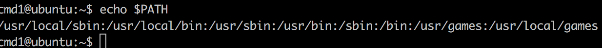
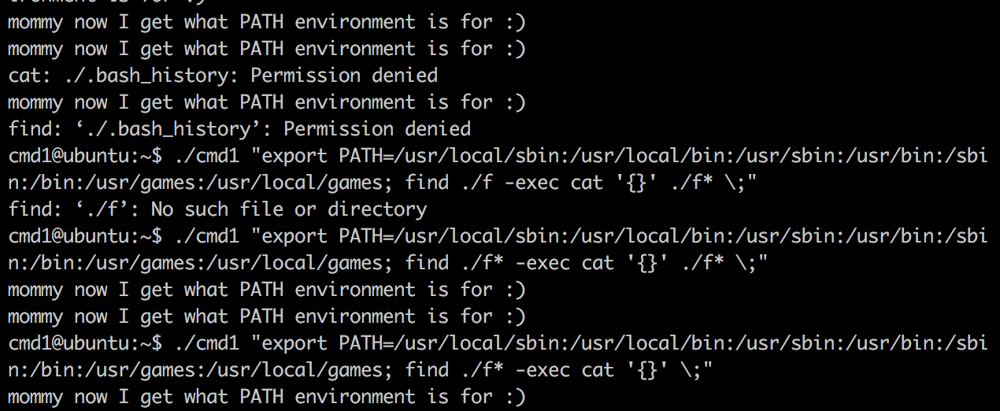

## 2017.7.24.
## Sungkyu Cho - sungkyu1.cho@gmail.com

PWNABLE KR - TODDLER - cmd1 - 1pt

곰곰히 생각해보면 별로 어려운 문제는 아닌 듯 하지만, 역시 시간은 좀 필요했음

# 0.우선은 소스코드 살펴보기
  코드 자체는 매우 단순하다. argv로부터 입력받은 값들 중에 ```flag```, ```sh```, ```tmp```라는 문자열이 있으면 ```filter()```에서 걸러지고 없으면 argv[1]에 있는 문자열을 ```system()```으로 실행시킴. ~~$/bin/cat flag하면 되겠네?~~

  하지만 쉽게 flag를 여는 것을 막기 위해서, ```putenv()```를 통해 ```cat``` 함수로 간단하게 호출하는 것은 막고 있음

  그래서 우선은 기본적으로 설정된 PATH 값을 가져오고...

  

  이제 이걸 어떻게 실행하나 곰곰히 생각해 보다가 문득 생각난 것이 ```exec()```와 ```execve()``` 라서 구글에 검색해보니 첫 페이지가 이거

  [find 와 exec](http://blog.daum.net/mcchijun/15418492)

  아.. 맞아 이런 게 있었지..

  즉, 특정 파일을 찾다가 조건에 맞으면 해당 특정 명령어를 수행시킬 수 있는 애였는데. 솔직히 이게 될 지 안될지 처음에 의심했던 게, find 에 -exec 옵션이 제거된 것으로 기억을 했었음.

  그래서 mac과 ubuntu에서 실험을 해보니 나의 착각.

  ```$find ./ -exec cat '{}' \; ```


# 1. Exploit
  * 결국 환경변수를 잘 셋업해주고
  * ```;``` 로 command injection을 수행하여 exec로 찍어주면 됨 (이 때, 필터링 문구는 쓰이지 않도록..)
  * 몇 차례의 튜닝을 거쳐 아래와 같이 성공. (명령어가 익숙치 않아서..)

  
