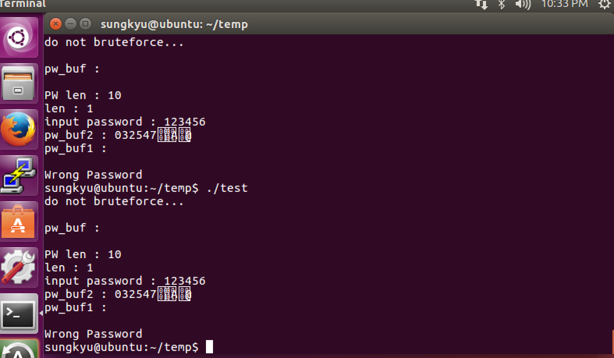
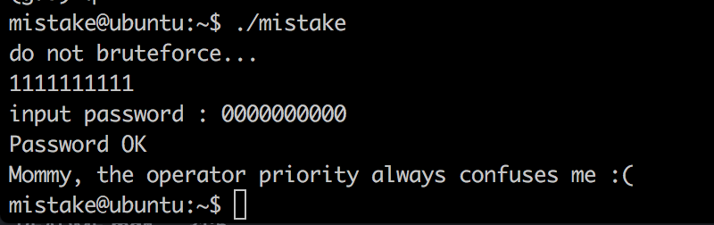

## 2017.7.24.
## Sungkyu Cho - sungkyu1.cho@gmail.com

PWNABLE KR - TODDLER - mistake - 1pt

1pt 짜리라고 하여 우습게 봤다가 생각보다는 오래 살펴봤음. 다만, 혼자 봤으면 아직도 보고 있었을 듯

Special thanks to @lili

# 0.우선은 소스코드 살펴보기
  대충보면, 결국 password 파일 내에 적혀져 있는 값과 stdin으로 입력받은 값을 ```xor()``` 하여 나오는 값을 비교해보고 그게 같으면 flag.

  이건 잘 살펴보면 쉽게 풀린다고 했는데, 아무리 봐도 사실 어디에 값을 밀어넣어야 하는지를 잘 모르겠어서 좀 손을 놓고 있었는데 @lili님이 힌트를 주심.


# 1.Check it up

  소스코드를 복사해서 ubuntu에 깔아서 코드를 돌려보면서 각 버퍼의 값을 다 찍어봄. ~~간만에 해보는 printf 디버깅~~

  

  * 두 가지를 알게 되었는데
    1) password 파일 안에 있는 값이 전혀 버퍼에 안들어가는 것이었고
    2) ```do not bruteforce...```가 찍힌 후, ```input password : ```가 자연스럽게 나오는 것인 줄 알았는데 **엔터를 쳐야나온다는 것** 이었다
  * 즉, ~~```sleep()``` 중이라고 믿고 있었던~~ 입력받은 엔터값이 pw_buf1에 들어가는 값이었고, pw_buf2는 ```input password : ``` 이후에 입력받은 값이었던 것이다.

# 2. Exploit
  * 그렇다면, 원래 입력받아야 하는 pw_buf2의 ```XOR``` 연산을 한 이후의 결과값이 password에 저장되어 있을 것으로 믿었던 pw_buf1의 값과 같아야 할 것이므로
  * ```1111111111``` 과 ```0000000000```을 입력하면??
  
  ~~shit~~

# 3. 원인 분석
  * 원래대로라면, 정확한 분석 이후에 pwn을 해야 하지만.. 이번에는 좀 그러질 못했음
  * 위에서 **엔터를 쳐야 다음 문구가 나온다** 는 것에 비추어보면, ```password``` 파일을 제대로 읽어오질 못한다는 점을 알 수 있음

```c
  int fd;
	if(fd=open("/home/mistake/password",O_RDONLY,0400) < 0){
		printf("can't open password %d\n", fd);
		return 0;
	}
```

  * 결국 위의 코드가 잘못되었다는 것인데, file descriptor를 기반으로 에러를 확인하는 코드는 보통 아래와 같이 짠다

```c
  fd = open("/home/sungkyu.txt", O_RDONLY);

  if (fd == -1)
        printf ("Error.... \n");
  else
        printf ("Success...!!! FD is : %d \n" , fd);
```
  * 즉, ```fd```에 값을 불러들인 이후에 그 값을 에러로 체크해야 하는데, 연산자 우선순위가 잘못되어 있음
  * [MSDN 연산자 우선순위](https://msdn.microsoft.com/ko-kr/library/2bxt6kc4.aspx)
  * 위 사이트에서 보듯이, ```<```과 ```=```은 한참의 차이가 있으며 **원래 목적한 바와는 다르게 ```open``` 이후에 떨어지는 1값이 0보다 크냐는 논리연산이 떨어지고, 그 결과(False)으로 인해 fd에 0 값이 떨어진다**
  * file descriptor가 0 이라는 것은 stdin: [링크참고](https://en.wikipedia.org/wiki/File_descriptor)
  * 결론적으로 ```password```파일이 아닌 입력값을 참조하게 된다는 것이었음
  * 아래는 혹시나 싶어 테스트로 만들어본 코드인데, 결국 아래처럼 동작한다는 것이 결론임

```c
#include<stdio.h>

int main(void)
{
  char testbuf[10]={0};

  read(0,testbuf, 10);

  printf("test buf : %s\n", testbuf);
  printf("return : %d\n", 1<0);

  return 0;
}   
```
