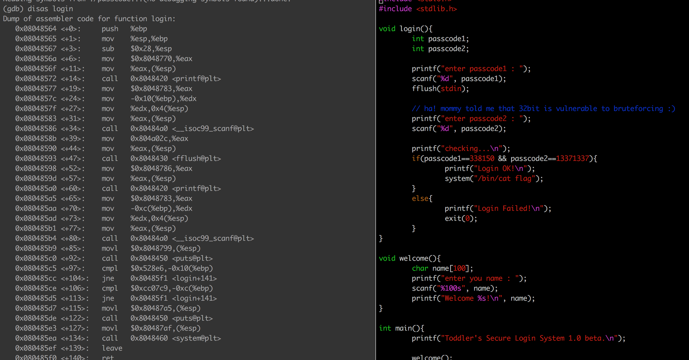
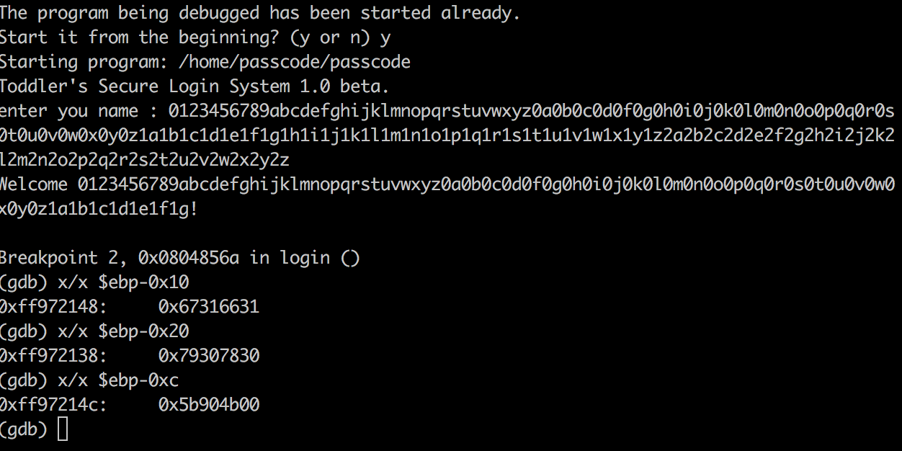
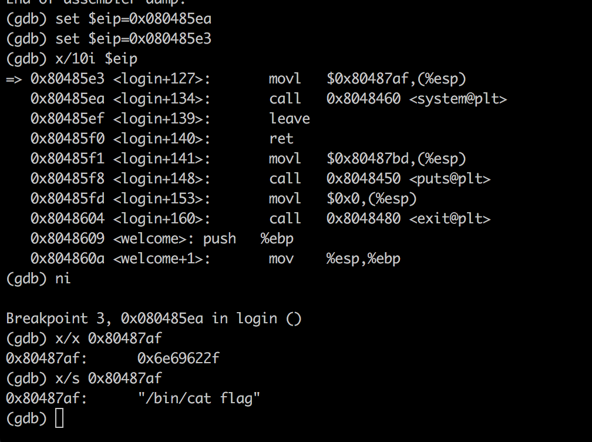
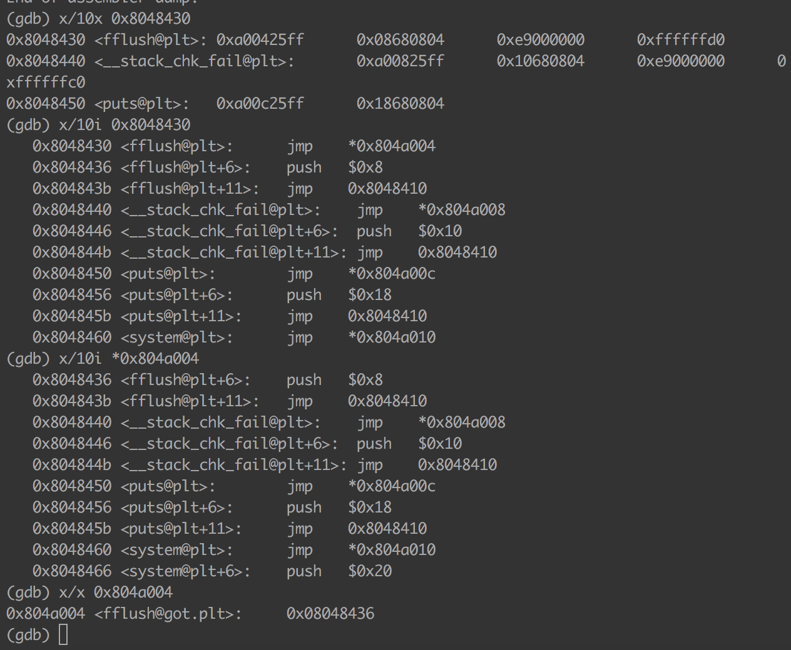
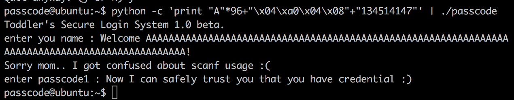

## 2017.7.22.
## Sungkyu Cho - sungkyu1.cho@gmail.com

PWNABLE KR - TODDLER - Passcode - 10pt

쉽게 풀릴 줄 알았던 문제인데, 의외로 정말 오랫동안 애를 먹었던 문제.
이유는 나중에 설명을 하겠지만, 작은 힌트에 대해서 너무 쉽게 생각했던 내 안이함이 큰 원인이었다.

# 0.우선은 소스코드 살펴보기
  passcode.c 파일을 살펴보면 welcome() 에서 username 을 받고, login()에서 모든 비교 작업을 하는 것을 알 수 있음. 매우 간단한 코드.

  그럼 이제 실제로 어딜 보면 좋을지를 알기 위해서 gdb 로 asm 코드를 보니

  

  * passcode1 에는 338150, passcode2 에는 13371337을 집어넣으면 flag를 잡을 것이고
  * passcode1 과 passcode2는 아마도 ```$ebp-0x10``` 과 ```$ebp-0xc```에 있을 것으로 추정됨
    - 이유는,cmp 명령어가 두 번 보이는데 그게 각각 338150과 13371337을 비교하기 위한 것일테고
    - 그 비교 대상이라고 하면 결국 passcode1과 passcode2 밖에 없기 때문임
  * 아마도 추정하길 ~~추정은 금물. 난 다 틀려~~ username으로 받아들인 변수가 passcode1과 passcode2에 착착 들어가겠지? 라는 착각으로 조금 더 살펴보기 시작함

# 1.처음에 쉽게 생각했던 이유
  동작내용을 보면 "name" 변수에 string 을 받아들이는데, 아마도 여기서 뭔가 터지는 부분이 있겠거니 하는 마음으로 매우 긴 string을 포함시켰음
  이 때, 어디서 에러를 발생시키는지 위치를 정확하게 파악하기 위해서 사용한 string은 아래와 같음

  ```0123456789abcdefghijklmnopqrstuvwxyz0a0b0c0d0f0g0h0i0j0k0l0m0n0o0p0q0r0s0t0u0v0w0x0y0z1a1b1c1d1e1f1g1h1i1j1k1l1m1n1o1p1q1r1s1t1u1v1w1x1y1z2a2b2c2d2e2f2g2h2i2j2k2l2m2n2o2p2q2r2s2t2u2v2w2x2y2z```

  

  * 예상과 비슷하게 ```$ebp-0x10```과 ```$ebp-0xc```에는 비교 대상이 포함되었고, ```$ebp-0x10```에 ```name``` 변수의 맨 마지막 4 byte가 들어가는 것을 확인함
  * 0x67316631은 ```1f1g``` 이므로 입력 맨 마지막 변수가 비교대상으로 포함되는 것을 알 수 있었음

# 2. 시련은 여기부터
   숱한 삽질을 해도, 어떻게든 ```passcode1```에는 값이 들어가고 또 비교문구도 통과도 하지만
   * 더 긴 ~~그리고 더 긴, 긴...~~~ username 을 넣어봐도
   * username은 짧게 하고 passcode1에 긴 값을 넣어봐도

   아무래도 더 진행은 어려웠는데...(사실 걍 포기한 상태였고, 그 이후에 pwnable kr 을 모두 풀어보자는 그룹에 가입)

# 3. Assist
   GOT와 PLT를 봐보라는 조언으로 다시 시작.

   [GOT와 PLT #1](https://bpsecblog.wordpress.com/2016/03/07/about_got_plt_1/)

   [GOT와 PLT #2](http://expointer.tistory.com/13)

   * Special thanks to @hackpupu & @min

# 4. Reload
   (앞서 말했던 것처럼)결론적으로 내가 가장 등한시 했던 부분이 바로 scanf 함수에 대한 이해였음. scanf를 너무 쉽게 사용했음에도 그것에 대해서 잘 고민해보는 시간이 없었던터라..

   [scanf 설명 ~~너무도 당연한~~~](http://itguru.tistory.com/36)

곰곰히 잘 생각해보면
1) scanf("%d", &var)는 var의 주소가 0x0add 라면 0x0add에 입력받은 10진정수를 저장하라는 것이고 1000을 입력하면 0x0add = 1000 이 된다. ~~~당연하지~~~
2) 근데 현재 passcode 상에서의 code 는 ```&``` 가 없는 상태인데 여기에 1000을 입력하면
- 1000이라는 주소를 사용자가 지정하게 되어버리는 꼴
- 따라서, scanf 함수 내에서 당연히 죽어버리게 됨

3) 결론적으로 **코드에서 작성된 scanf의 bug를 이용하여 exploit 하는 방향이었고, 이 때 활용할 수 있는 카드가 GOT&PLT** 였던 것임
4) 그럼 대상이 어떻게 되어야 할 것이냐를 보면, 위 ```gdb) disas login``` 상에서 쭉 보면 알겠지만, 간단하게 fflush가 뛰어야 할 정상 주소가 아닌, ```cmp``` 명령어 이후의 ```0x80485e3```으로 뛰면 된다. 바로 뒤에 system 함수가 호출되는 ```0x80485ea```로 뛰지 않는 이유는 간단하다. ``` "/bin/cat flag" ``` 라는 문자열이 셋업된 이후에 뛰어야 하기 때문임



_강제로 ```eip```를 0x80485e3으로 변경한 후 스택에 올라온 값을 확인해보면 /bin/cat flag가 출격 대기중임_

결론적으로, scanf를 통해(+코드 버그)
  + passcode1의 값(100byte 끝의 마지막 4byte)를 지정할 수 있고
  + passcode1가 위치할 주소를 정할 수 있으므로
  + 특정 위치와 그 값을 지정할 수 있다는 얘기이며
  + 이 조건은 fflush 함수를 살펴보면 알게되듯이, plt 를 통해 ```jmp *(addr)``` 의 형식으로 지정되어 있는 fflush 함수를 활용한 특정위치로의 코드 점프를 가능하게 함 (아래 그림 참조)



# 5. Exploit
 payload 구성은 아래와 같음
 + 96byte의 의미없는 byte stream -> "A"
 + scanf를 통해 입력될 passcode1의 위치(주소값) -> ```"0x8048a004"``` (fflush 원래 코드가 위치하는 jmp 이후의 주소)
 + scanf안에 들어갈 ```passcode1```값 (```jmp```를 통해 어디로 뛸 지 주소값) -> ```0x80485e3```(fflush를 통해 동작하게 될 코드 위치)

 

 여기서 ```134514147```은 ```0x80485e3```의 decimal value인데. 이걸 hexa로 넣을지, ```""``` 를 넣을지 뺄지 가지고도 한참 삽질했던 것은 비밀. 근데 그 비밀의 열쇠도 결국 ```scanf```가 가지고 있었다. ```%d"```로 값을 받아들였으니, 당연히 decimal로 입력해야 하는 것이니까..ㅋ
