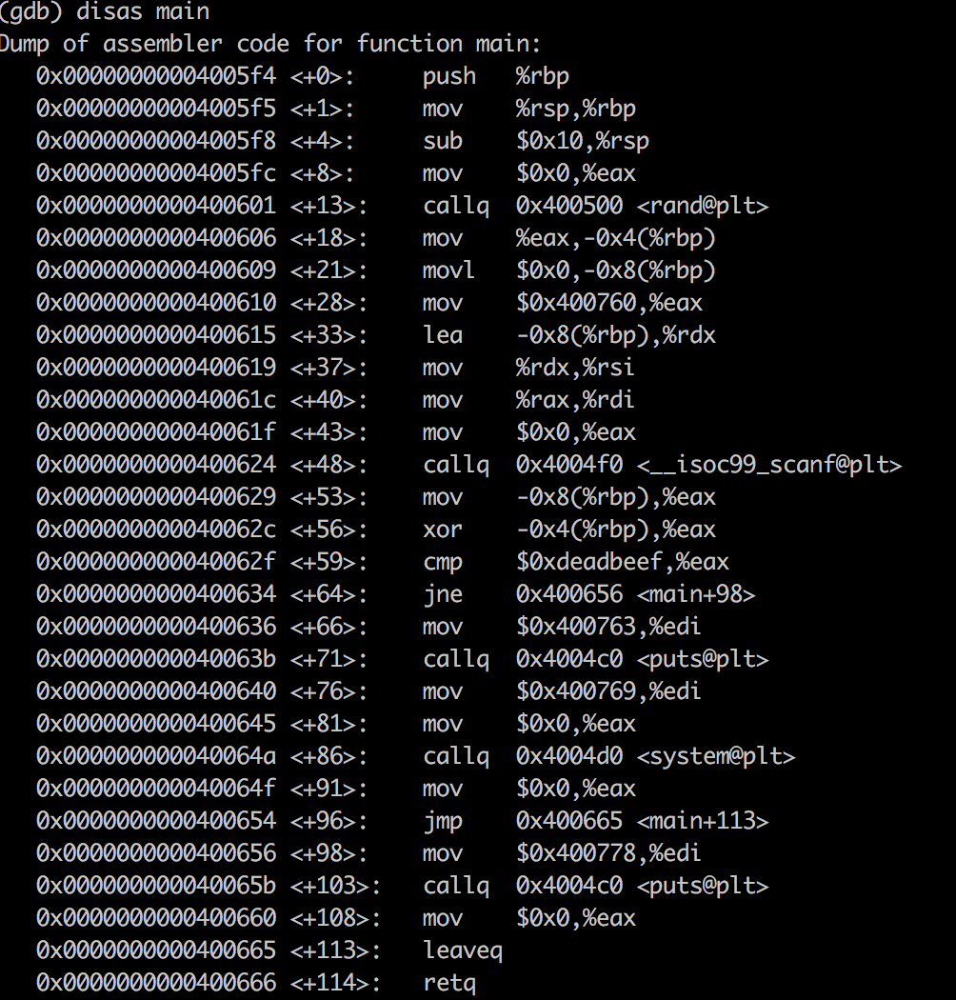
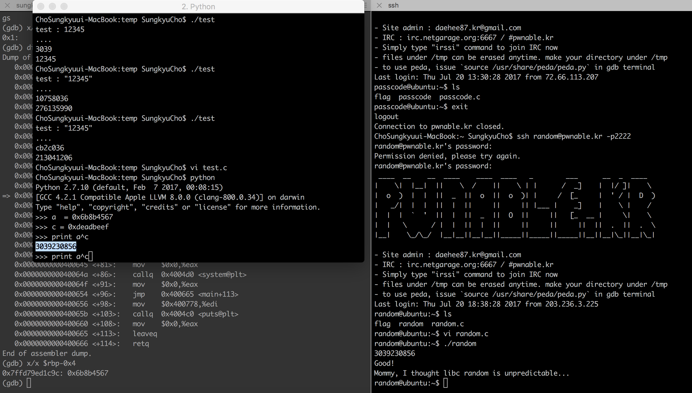

## 2017.7.22.
## Sungkyu Cho - sungkyu1.cho@gmail.com

PWNABLE KR - TODDLER - Random - 1pt

쉬어가기 코너인 듯 하지만, 앞으로의 역경을 미리 알려주는 복선이라고 생각함. 이유는 64bit 가 나오기 시작했기 때문.

# 0.우선은 소스코드 살펴보기
  소스 상으로 봐도, 입력받은 숫자를 rand() 를 통해 나온 결과값과 XOR 하여 그 결과가 0xdeadbeef 이면 클리어.

  즉, rand()에서 출력되는 값이 난수일 거 같지는 않고 입력할 결과값만 잘 계산하면 된다는 뜻.

  A ^ B = C 라면, A = B ^ C 라는 것은 예전에 EFS(Encrypted File System)에서 IV 값을 계산해날 때 알고 있었던터여서 그리 난감하진 않았음. ~~솔직히 처음에 ^ 연산자가 AND 연산인 줄 알고 굉장히 난감했던 것은 비밀~~

  그럼 이제 실제로 어딜 보면 좋을지를 알기 위해서 gdb 로 asm 코드를 보니

  

  * 딱 봐도 ```random``` 변수는 ```$rbp-0x4``` 또는 ```$rbp-0x8```에 저장될 것으로 보임
  * 이유는 rand 함수를 호출한 이후에 ```mov```를 통해 값이 셋업되는 부분과, ```xor``` 연산을 수행하는 지점에 해당 값을 사용하기 때문이다.

# 1.Check it up
  GDB로 해당 지점의 값을 찍어본 결과

  

  * 예상과 같이 ```0x6b8b4567```이라는 값이 나왔고
  * 그걸 python으로 ```xor``` 해보면 ```3039230856```이라는 값이 나옴


# 2. Exploit
  * 위에서 나온 ```3039230856```을 넣으면 끝
  * 잠깐 쉬어가기 코너였던 것 같지만, 사실 ARM이나 X86의 instruction set은 ~~잘 알지는 못해도~~~ 눈에는 익어있는 편인데.. 64bit 명령어는 사실 낯설음.. 이것도 공부해야 하나보다;;
