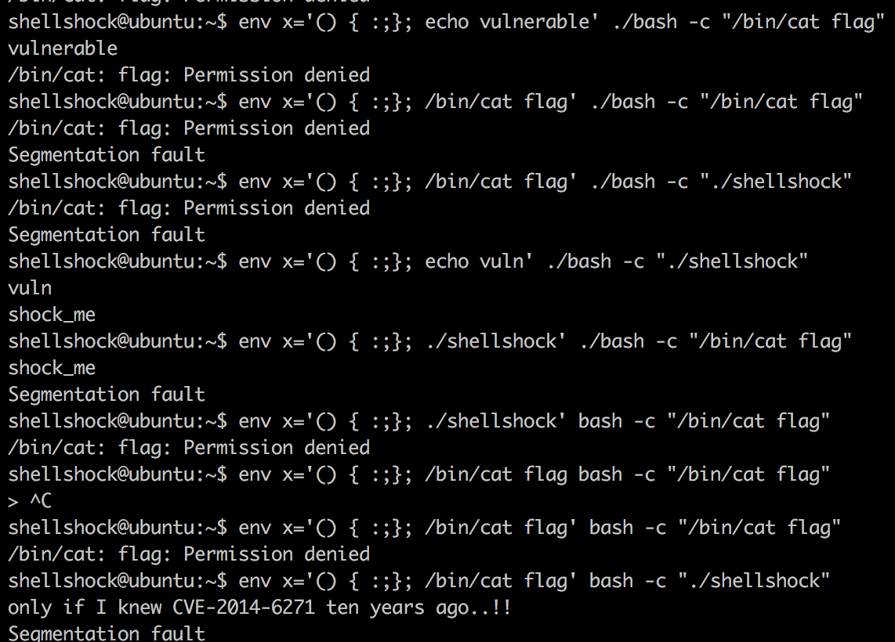

## 2017.7.24.
## Sungkyu Cho - sungkyu1.cho@gmail.com

PWNABLE KR - TODDLER - Shellshock - 1pt

IT 업무(특히 보안)를 한 사람이라면 절대 잊을 수 없었던 취약점인 bash [shellshock](https://en.wikipedia.org/wiki/Shellshock_(software_bug))와 관련된 내용임. 아마도 취약점이 발표된 후, 1년이 넘도록 이 취약점을 이용한 공격이 끊이지 않았다는 내용을 관제팀으로부터 들었을만큼 일반적인 공격.

# 0.우선은 소스코드 살펴보기
  매우 심플함. 권한이 올라간 이후 아래 코드가 끝.

  ```{.c}
  system("/home/shellshock/bash -c 'echo shock_me'");
  ```
  그렇다면 공격할 수 있는 지점은 shellshock 취약점을 이용해서 명령어를 수행하는 수 밖에 없을 듯.

# 1.Check it up
  위 [링크](https://en.wikipedia.org/wiki/Shellshock_(software_bug))에서 test vector는 아주 잘 나와있음

  ```shell

env x='() { :;}; echo vulnerable' bash -c "echo this is a test"

  ```

  취약점 내용은 ```{}``` 내에서 수행되어야 하는 기능이 삐져나와서 ```;``` 뒤까지 있는 명령어가 수행되기 때문에 발생하는 취약점임. (물론 실제 shellshock는 많은 variants가 있다. 관련 내용도 상기 링크에 있음)

  이걸 그대로 이용했음. ~~여러 번 삽질은 필수~~

  간단히 정리하자면, ```x=``` 에 들어가는 내용은 해당 bash가 참조하는 ```env``` 내에 저장되는 변수이며, 취약점으로 인해 해당 변수 뒤 쪽에 명령어를 집어넣을 수 있음

  ```env```는 shell이 참고하는 변수들이 모여있는 곳이므로, 요 타겟하는 ```/bin/cat flag```를 저장해두고 이것을 trigger하기 위해서 뒤에 ```./shellshock```을 호출하면 되지 않을까? 하고 시도해봄

# 2. Exploit

  

  * 뒤에 seg fault가 나는 거 보면 뭔가 완벽하진 않은 거 같은데.. ~~일단 되니까 패쓰~~
  * ```./bash```를 불러야 하나 ```bash```를 그냥 불러야 하나로 고민을 좀 했었는데, 결국 같은 shell에서 불러야 하므로 ```bash```가 맞음 (변수설정은 다른 shell에서는 날라가니까)
